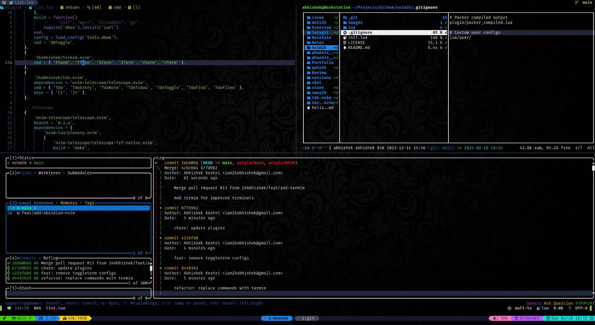

<div align = "center">

<h1><a href="https://github.com/2kabhishek/termim.nvim">termim.nvim</a></h1>

<a href="https://github.com/2KAbhishek/termim.nvim/blob/main/LICENSE">
 </a>

<a href="https://github.com/2KAbhishek/termim.nvim/graphs/contributors">
 </a>

<a href="https://github.com/2KAbhishek/termim.nvim/stargazers">
</a>

<a href="https://github.com/2KAbhishek/termim.nvim/network/members">
 </a>

<a href="https://github.com/2KAbhishek/termim.nvim/watchers">
 </a>

<a href="https://github.com/2KAbhishek/termim.nvim/pulse">
 </a>

<h3>Neovim Terminal, Improved 🦾💻</h3>

<figure>
  
  <br/>
  <figcaption>termim.nvim in action</figcaption>
</figure>

</div>

termim.nvim improves your default neovim terminal experience while still keeping things super simple.

## ✨ Features

- Cleans up unnecessary clutter from terminal UI
- Auto closes terminal once process exits
- Terminals do not mess with your buffer list
- Handy commands to access full screen and split terminals
- Extend commands easily with any program of your choice

## ⚡ Setup

### ⚙️ Requirements

- neovim

### 💻 Installation

Add the following to your lazy/packer config

```lua
    -- Lazy
    {
        '2kabhishek/termim.nvim',
        cmd = { 'Fterm', 'FTerm', 'Sterm', 'STerm', 'Vterm', 'VTerm' },
    },

    -- Packer
    use '2kabhishek/termim.nvim'
```

## 🚀 Usage

### 📡 Commands

`termim.nvim` adds the following commands:

- `Fterm`: open terminal in new tab
- `FTerm`: same as Fterm but stays open after process exits
- `Sterm`: open terminal in new horizontal split
- `STerm`: same as Sterm but stays open after process exits
- `Vterm`: open terminal in new vertical split
- `VTerm`: same as Vterm but stays open after process exits

All the commands accept optional command as arg, if command is missing, your default shell will run

- `Fterm lazygit`: will open lazygit in a new tab

### ⌨️ Mappings

`termim.nvim` adds the following mappings:

- <kbd>J</kbd> <kbd>J</kbd> — Return to normal mode in terminals, remap for `<C-\><C-n>`

#### Recommended which-key Mappings

Other than the standard commands, you can use which-key to create your own commands.

```lua
    t = {
        name = 'Terminal',
        ['`'] = { '<cmd>Sterm<cr>', 'Horizontal Terminal' },
        e = { '<cmd>Sterm iex<cr>', 'Elixir' },
        g = { '<cmd>Fterm lazygit<cr>', 'Lazygit' },
        n = { '<cmd>Sterm node<cr>', 'Node' },
        p = { '<cmd>Sterm bpython<cr>', 'Python' },
        r = { '<cmd>Sterm irb<cr>', 'Ruby' },
        s = { '<cmd>Sterm<cr>', 'Horizontal Terminal' },
        t = { '<cmd>Fterm<cr>', 'Terminal' },
        v = { '<cmd>Vterm<cr>', 'Vertical Terminal' },
    },
```

## 🏗️ What's Next

You tell me!

## 🧑‍💻 Behind The Code

### 🌈 Inspiration

Most terminal plugins offer a lot more than I needed, whereas I just needed some small enhancements of the default neovim terminal experience.

### 💡 Challenges/Learnings

- Figuring out some autogroup and buffer related APIs

### 🧰 Tooling

- [dots2k](https://github.com/2kabhishek/dots2k) — Dev Environment
- [mac2k](https://github.com/2kabhishek/mac2k) — Mac Dev Environment
- [nvim2k](https://github.com/2kabhishek/nvim2k) — Personalized Editor

### 🔍 More Info

- [tdo.nvim](https://github.com/2kabhishek/tdo.nvim) — Fast and simple note-taking in neovim
- [co-author.nvim](https://github.com/2kabhishek/co-author.nvim) — Easily add git co authors
- [nerdy.nvim](https://github.com/2kabhishek/nerdy.nvim) — Easily add nerd glyphs

<hr>

<div align="center">

<strong>⭐ hit the star button if you found this useful ⭐</strong><br>

<a href="https://github.com/2KAbhishek/termim.nvim">Source</a>
| <a href="https://2kabhishek.github.io/blog" target="_blank">Blog </a>
| <a href="https://twitter.com/2kabhishek" target="_blank">Twitter </a>
| <a href="https://linkedin.com/in/2kabhishek" target="_blank">LinkedIn </a>
| <a href="https://2kabhishek.github.io/links" target="_blank">More Links </a>
| <a href="https://2kabhishek.github.io/projects" target="_blank">Other Projects </a>

</div>
